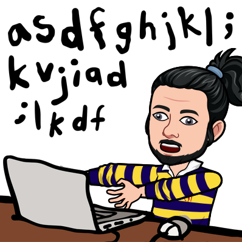

### < Hello World /> 

My name's Shubhra Agarwal, currently a second year student pursuing B.Tech from SRM Institute of Science and Technology in the field of Computer Science. Currently, I am a MERN stack web and app developer enhancing my skills using Machine Learning.  

- 🌱 I’m currently learning - Machine Learning
- 👯 I’m looking to collaborate on - Development or Open source projects
- 💬 Ask me about - MERN, TypeScript, Python, C++
- 😄 Pronouns: He/They
- 📫 Let's Connect:  
  
  
  
  
- Check out my newsletter <a href="https://getrevue.co/profile/shubhracodes">here </a>  

 

## Languages/Systems/Tools

  
  
   
  
  

  
  
  
  
  
  
  
  
   
  
  
  
  

 

 

  

 

<!--
**shubhraagarwal/shubhraagarwal** is a ✨ _special_ ✨ repository because its `README.md` (this file) appears on your GitHub profile.

Here are some ideas to get you started:

- 🔭 I’m currently working on ...
- 🌱 I’m currently learning ...
- 👯 I’m looking to collaborate on ...
- 🤔 I’m looking for help with ...
- 💬 Ask me about ...
- 📫 How to reach me: ...
- 😄 Pronouns: ...
- ⚡ Fun fact: ...
-->
